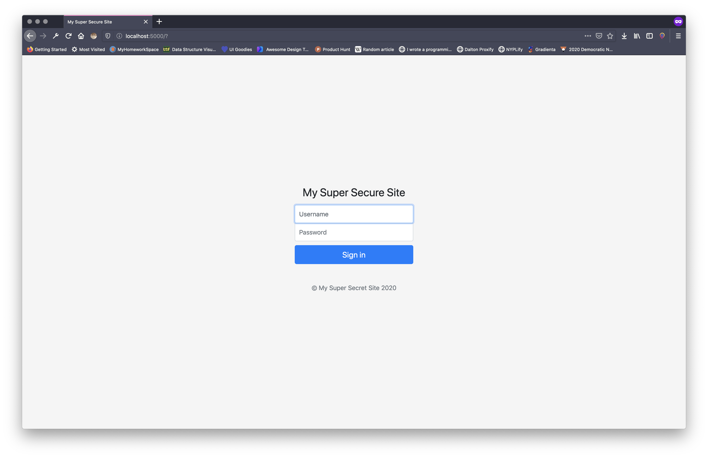
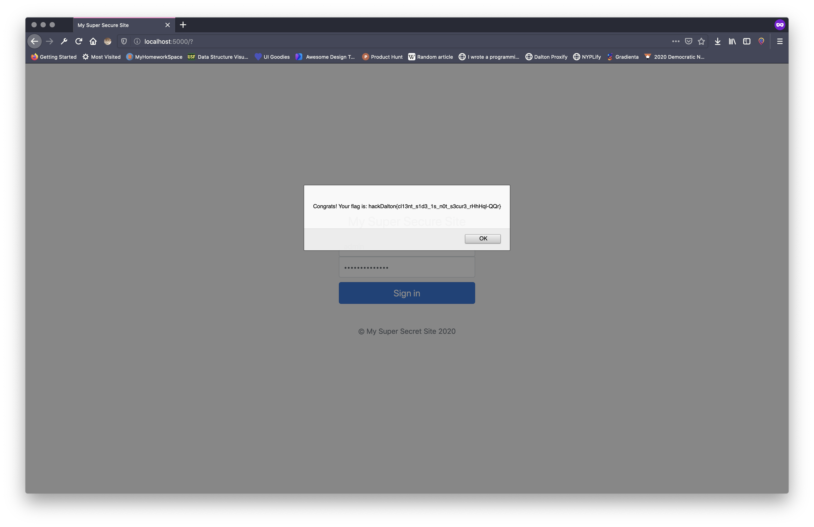

# HackDalton: Let Me In 1 (Writeup)

> Warning! There are spoilers ahead

Upon loading the website you are presented with a simple login screen. 



If we use the view source option on the browser, we can see this script tag at the bottom of the page.

```html
<script>
        $("#submit").click(function () {
            if ($("#username").val() == "admin" && $("#password").val() == "superSekret1!1") {
                showFlag();
                return false
            } else {
                alert("Invalid login")
            }
        });
</script>
```

In that script, we can see that the website is checking for the username `admin` and the password `superSekret1!1`.

When we try that username and password combination, we are presented with the flag.

